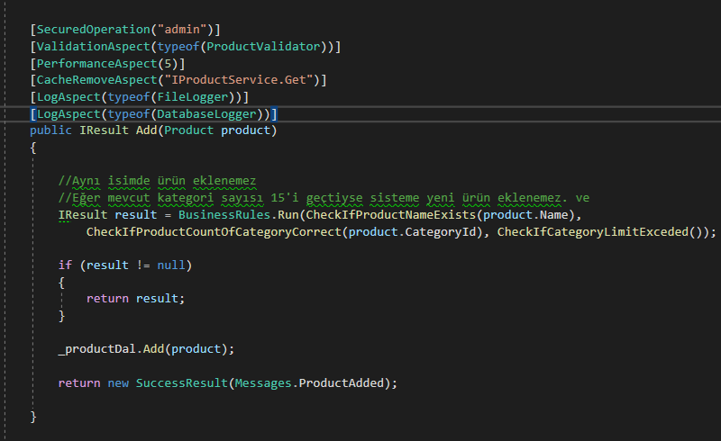

# Aspect Oriented Programming 

Aspect Oriented Programming, projede **"Cross Cutting Concerns"** isimli yapıların, kod kalabalığı yaratarak kullanımını önleyen,  temiz kod yazma ve sürdürülebilir yazılım geliştirme avantajları sağlayan yapıdır.

Projede Autofac tabanlı IoC Container yapısı ve AOP yapısı kullanılmıştır. Ek olarak, projede şuana kadar öğrendiğim yapıların hemen hepsini kullanmaya özen gösterdim.

## Projede Yer Alan Aspectler

- Validation Aspect (Fluent Validation)
- Cache Aspect (In Memory)
- Performance Aspect
- Transaction Aspect
- Log Aspect (Serilog)
- Exception Log Aspect (Serilog)
- Authorize Aspect

